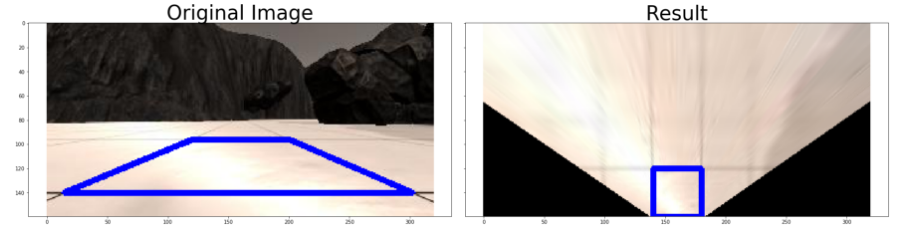
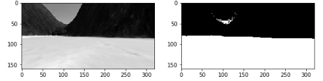
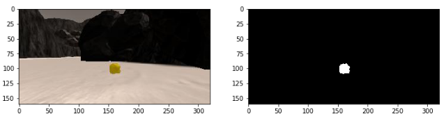

# Introduction

The purpose of this project is to write the code to drive the rover in the simulated Unity environment. The goal of the rover is to create maps of the terrain where it is placed to and to collect the yellow rocks. The code consists of 2 parts: a jupyter notebook which is used to debug the perception part of the project and Python scripts which perform the actual controlling of the rover. 

# Jupyter notebook

Please use Rover_Lab_Notebook_v2.ipynb file which is based on the "Online: Rover Lab" page of the course rather than Rover_Project_Test_Notebook.ipynb from the github repository.

## Image wrapping

In order to project the image visible from the camera mounted on the rover to the top-down view we use the OpenCV projective transform function. We can do it by manually setting correspondence between 4 points on the original image to 4 points on the top-down view (here we assume the 4 points make a rectangular and all of them are located on a plane). This code is not modified from the lecture notes. 

## Color thresholding

In order to detect drivable terrain and rocks we use color thresholding. For the first part I convert the image to the HSV color space (based on my tests it gives slightly better results) and apply manually selected thresholds - see the color_thresh function. For the rock detection I'm using thresholding in the original RGB color space as changing the color space did not give positive result in my tests.

## Coordinates transformation

In order to transfer segmentation from the rover camera to the top-down map we need to perform coordinate transformation from the coordinates attached to the rover to the global coordinates with using rover position and orientation given by telemetry.

## Processing function

The process_image function combines all the steps listed above:
- wrapping the images to the top-down view
- color thresholding to segment drivable terrain and rocks
- coordinate transformation to project the segmentation to the global coordinate system
- Visualization of the map and segmentation on the final output image

# Autonomous navigation

## Perception step (perception.py)

The perception step of the Python scripts is mostly a copy of the steps described above.

## Making decision (decision.py)

The decision part was modified to implement a workaround for the case when the rover is stuck. It usually happens in case the terrain in front of the rover is incorrectly classified as drivable but the rover could not drive forward. The workaround is check if position of the rover is not changing (is_same_position function). And if so, stop, rotate a bit and try again.

## Driving rover (driving_rover.py)

In this file I added a call to the logic for collecting rocks and initialization of new variables I added to the RoverState class. The logic for collecting the rocs (rock_pickup function) gets called the first time when we see a rock in the rover camera. Then I continue calling the rock_pickup function until the rock_pickup_flag is unset (it happens after collecting the rock or after exceeding certain number of iterations)

## Collecting rocs (rock_pickup.py)

When we first see a rock in the rover camera we save its estimated location into the Rover.rock_target_pos variable - global position of the rock. If later we lose the rock from the camera view the rover would try to rotate so that the saved position of the rock gets visible again (for example, it might happen in case the speed of the rover was too fast to stop while the rock is visible in the camera). 

When the rock is visible in the camera, the rover tries to rotate to make the rock in the center of its view and drive slowly forward. When the rock gets close enough to pick it up with the manipulator a pickup command gets sent.

In order to prevent the rover from being stuck there are 2 checks for that:
- First, we get out of the rocks collecting mode if there is no rock visible in the camera view for the last Rover.no_rock_counter_threshold
- Second, the check for the rover being stuck (see the "Making decision" section) still applies here. For example, if the rover drives towards a rock but gets stuck, it will try to rotate. And there are 2 possible outcomes here: it can either get out of being stuck and continue approaching the rock, or it can lose the rock from camera view and then will rotate to find it again. 

Here is the final video which demonstrates the rover in action. I stopped recording when it reaches 40% of the map coverage:

